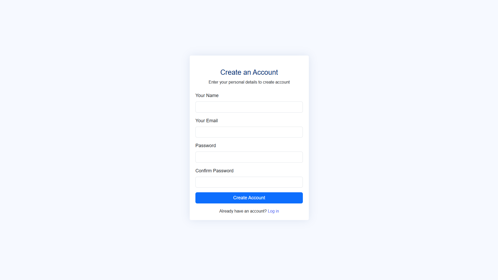
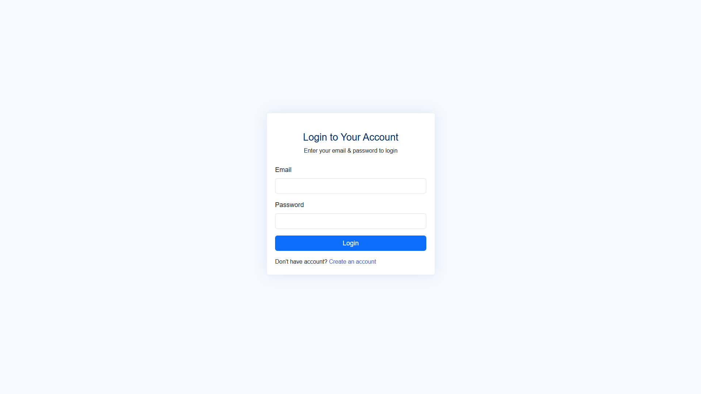
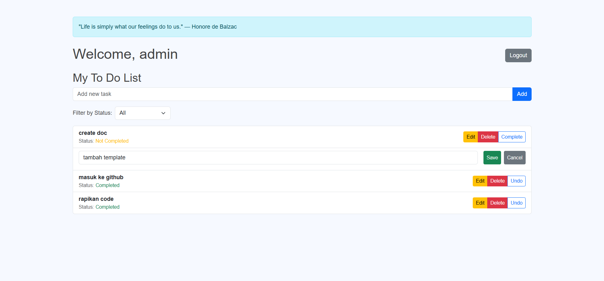

# Aplikasi ToDo - Laravel + Vue.js + NiceAdmin

---

## 📦 Instruksi Setup Proyek

### 1. Clone Repository

```bash
git clone https://github.com/FirdaRN/LaravelVueToDo.git
cd LaravelVueToDo
```

### 2. Install Dependency Backend

```bash
composer install
```

### 3. Install Dependency Frontend

```bash
npm install
```

### 4. Setup Environment

Copy file `.env.example` menjadi `.env`, lalu ubah sesuai kebutuhan:

```bash
cp .env.example .env
```

Edit file `.env` untuk mengatur database dan konfigurasi lainnya.

### 5. Generate Application Key

```bash
php artisan key:generate
```

### 6. Jalankan Migrasi Database

```bash
php artisan migrate
```

### 7. Build Asset Frontend

```bash
npm run dev      # untuk development
npm run build    # untuk production
```

### 8. Jalankan Server Laravel

```bash
php artisan serve
```

---

## 🧾 Struktur Proyek

```
.
laravel-vue-todo/
├── app/
│   ├── Models/                     # Model Eloquent (User, Task, dll)
│   └── Http/Controllers/           # Controller untuk API
├── database/
│   ├── migrations/
│   └── seeders/
├── public/
│   └── assets/                     # Asset CSS/JS dari NiceAdmin
├── resources/
│   └── js/
│       ├── components/             # Komponen halaman Vue: Login, Register, Tasks
│       ├── api.js                  # Konfigurasi axios (client API)
│       ├── app.js                  # Entry point Vue dan konfigurasi router
│       └── App.vue
├── routes/
│   └── api.php                     # Routing untuk endpoint API
├── .env
├── composer.json                   # Dependency Laravel dan autoload
├── package.json                    # Dependency frontend
└── README.md
```

---

## ⚙️ Teknologi yang Digunakan

### Backend:

* [Laravel 8](https://laravel.com)
* Passport (untuk autentikasi token API)
* MySQL

### Frontend:

* [Vue.js 3](https://vuejs.org/)
* [Vue Router](https://router.vuejs.org/)
* Axios untuk permintaan HTTP
* Bootstrap 5 (menggunakan tema NiceAdmin)

### UI Template:

* [NiceAdmin Bootstrap Template](https://bootstrapmade.com/nice-admin-bootstrap-admin-html-template/)

---

## Screenshot

### Register Page



### Login Page



### Dashboard


